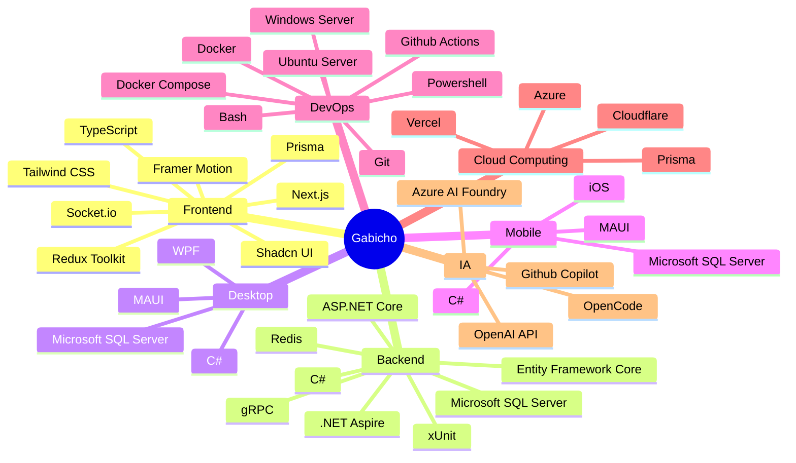

  
  

### Vortex Suite

| Proyecto | Descripción | Stack |
|---|---|---|
| 🌀 **[Vortex ERP](https://github.com/ArcGabicho/vortex-erp)** | ERP generalista con IA para automatizar procesos administrativos y optimizar la gestión operativa. | C#, MAUI, MSSQL, Azure |
| 🌀 **[Vortex CRM](https://github.com/ArcGabicho/vortex-crm)** | CRM con IA, automatización de ventas, seguimiento inteligente y analítica avanzada. | C#, MAUI, MSSQL, Azure |
| 🌀 **[Vortex WMS](https://github.com/ArcGabicho/vortex-wms)** | WMS para logística de alto volumen: control de inventarios, picking, tracking. | C#, MAUI, MSSQL, Azure |
| 🌀 **[Vortex POS](https://github.com/ArcGabicho/vortex-pos)** | Punto de venta modular con inventario, facturación, reportes en tiempo real. | C#, MAUI, MSSQL, Azure |

### Sistemas Empresariales

| Proyecto | Cliente | Descripción | Stack |
|---|---|---|---|
| 🏢 **[Sistema CRM](https://github.com/ArcGabicho/sistema-crm-compina)** | COMPINA S.A.C. | Gestión de 6000+ clientes. | Next.js, ASP.NET Core, MSSQL, Azure |
| 🤖 **[Sistema RPA](https://github.com/ArcGabicho/sistema-rpa-dds)** | Data Discovery Solutions S.A.C. | Bots para automatización empresarial. | Next.js, ASP.NET Core, MSSQL, Azure |
| 📝 **[Sistema CMS](https://github.com/ArcGabicho/sistema-cms-ibgroup)** | IBGroup S.A.C. | Gestión de contenidos para blog corporativo. | Next.js, ASP.NET Core, MSSQL, Azure |
| 🚚 **[Sistema GGR](https://github.com/ArcGabicho/sistema-ggr-hpd)** | HPD Glass Group S.A.C. | Guías de remisión y despacho de mercancía. | Next.js, ASP.NET Core, MSSQL, Azure |

## Stack Principal

> [!NOTE]
> No solo escribo código; construyo ecosistemas — mi objetivo es desarrollar sistemas, plataformas y aplicaciones que eleven el nivel de innovación y tecnología de la próxima generación de empresas en Perú.